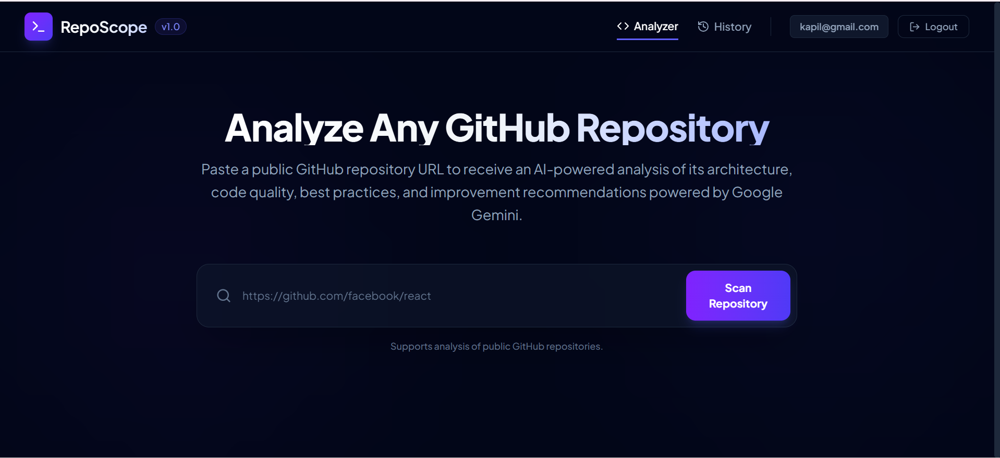
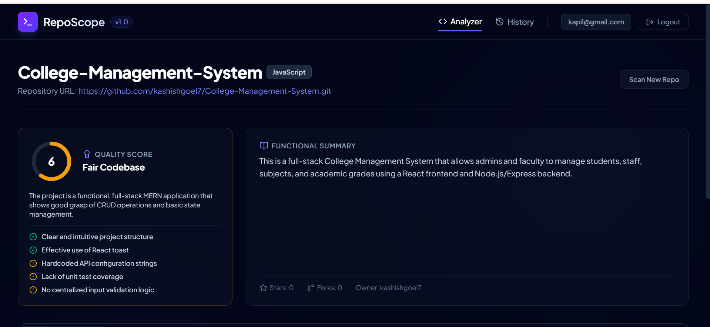
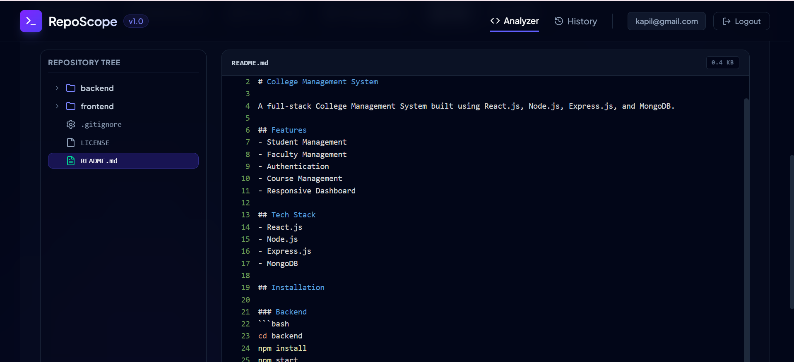
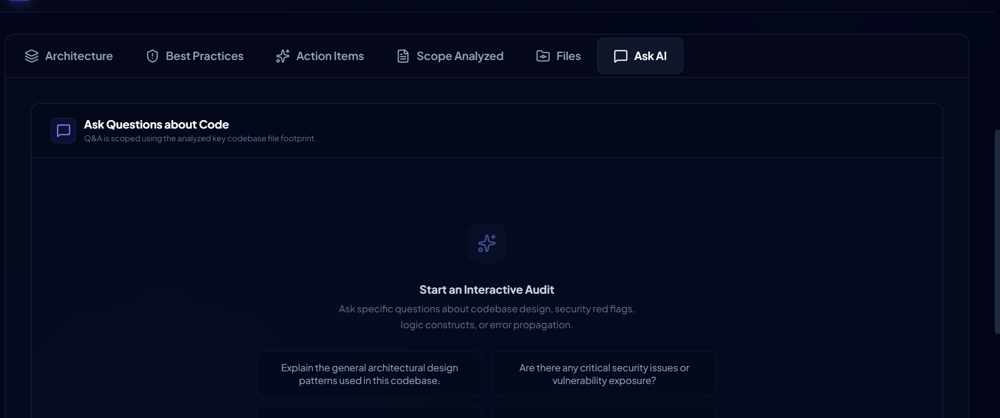

# 🔍 RepoScope

> AI-Powered GitHub Repository Analyzer built with the MERN stack and Google Gemini AI.

RepoScope is a full-stack web application that analyzes public GitHub repositories using Google Gemini AI. By simply providing a repository URL, users receive AI-generated insights on project architecture, code quality, best practices, and actionable improvement recommendations. The platform also includes an interactive file explorer, AI-powered repository chat, and analysis history.

---

## ✨ Features

- 🔗 Analyze any public GitHub repository
- 🤖 AI-powered repository analysis using Google Gemini AI
- 🏗️ Architecture and code quality assessment
- 💡 Best practices evaluation and improvement suggestions
- 📂 Interactive repository file explorer
- 💬 AI chat for repository-specific questions
- 📚 Repository analysis history
- 🔐 Secure JWT-based authentication
- ⚡ REST APIs protected with rate limiting

---

## 🛠️ Tech Stack

| Category       | Technologies                     |
| -------------- | -------------------------------- |
| Frontend       | React 19, Vite, Tailwind CSS v4  |
| Backend        | Node.js, Express.js              |
| Database       | MongoDB, Mongoose                |
| AI             | Google Gemini API                |
| Authentication | JWT, bcryptjs                    |
| Security       | Helmet, Express Rate Limit, CORS |
| Validation     | Zod                              |
| Routing        | React Router DOM                 |
| External APIs  | GitHub REST API                  |
| HTTP Client    | Axios                            |

---

## 📸 Screenshots

### 🏠 Home Dashboard



### 📊 AI Analysis Report



### 📂 Repository File Explorer



### 💬 AI Repository Chat



---

## 🚀 Installation

### Clone the repository

```bash
git clone https://github.com/kashishgoel7/RepoScope.git
cd RepoScope
```

### Backend

```bash
cd backend
npm install
npm run dev
```

### Frontend

Open a new terminal:

```bash
cd frontend
npm install
npm run dev
```

---

## 🔑 Environment Variables

Create a `.env` file inside the **backend** directory.

```env
PORT=
NODE_ENV=
MONGO_URI=
JWT_SECRET=
CLIENT_URL=
GITHUB_TOKEN=
GEMINI_API_KEY=
GEMINI_MODEL=
```

---

## 📖 How It Works

1. Enter a public GitHub repository URL.
2. RepoScope fetches repository metadata and important project files.
3. Relevant files are intelligently selected for analysis.
4. Google Gemini AI generates architecture, code quality, and best practice insights.
5. Results are displayed in an interactive dashboard.
6. Users can browse analyzed files and ask repository-specific questions through the integrated AI chat.
7. Every analysis is securely stored for future reference.

---

## 👨‍💻 Author

**Kashish Goel**

- GitHub: https://github.com/kashishgoel7

---

## 📄 License

This project is licensed under the MIT License.
