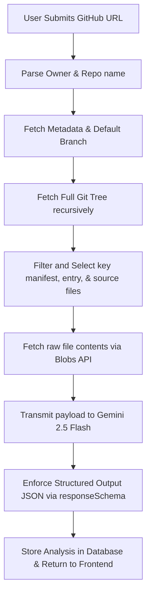

# RepoScope 🔍 — AI-Powered GitHub Repository Analyzer

RepoScope is a full-stack MERN application that performs automated architecture reviews and code quality audits on public GitHub repositories. Users submit a repository URL, and the system fetches the repo’s structural map, applies selection heuristics to extract high-context files, sends them to Gemini 2.5 Flash, and generates a structured dashboard report.

---

## 🛠️ Tech Stack & Key Libraries

- **Backend:** Node.js + Express
- **Database:** MongoDB + Mongoose (stores scanning histories per user)
- **Authentication:** JWT (JSON Web Tokens) stored in secure, CSRF-resistant `httpOnly` cookies + `bcryptjs` password hashing
- **Frontend:** React (Vite) + Tailwind CSS v4 (Vite-native) + Lucide Icons
- **AI Engine:** Google Gemini API (model: `gemini-2.5-flash`) using the official `@google/genai` SDK
- **GitHub Integration:** GitHub REST API (Git Trees + Blobs API)
- **Security:** `helmet` (HTTP headers), `express-rate-limit` (brute-force prevention), `cors`, and `zod` input validation

---

## 📐 Project Architecture

```
/reposcope
  ├── /backend
  │    ├── /config       # Database configuration (Mongoose setup)
  │    ├── /controllers  # Request handlers (authController, analysisController)
  │    ├── /middleware   # Route security (auth guards, rate limit configurations)
  │    ├── /models       # MongoDB schemas (User, Analysis)
  │    ├── /routes       # Route mappings (/api/auth, /api/analysis)
  │    ├── /services     # Pure logic isolates (githubService, geminiService)
  │    ├── server.js     # Entry point
  │    └── test-services.js # Integration CLI tester
  ├── /frontend
  │    ├── /src
  │    │    ├── /api         # Axios client
  │    │    ├── /components  # Reusable UI metrics, navbar, layout protectors
  │    │    ├── /context     # React AuthContext state provider
  │    │    └── /pages       # Dashboard, History, Details, Login, Register
  └── README.md
```

---

## 🚀 Getting Started

### Prerequisites
- Node.js (v18+)
- MongoDB running locally (`mongodb://localhost:27017/reposcope`) or an Atlas connection URI

### Step 1: Clone and Setup Backend
1. Navigate to `/backend`.
2. Copy `.env.example` to a new file named `.env`:
   ```bash
   cp .env.example .env
   ```
3. Populate `.env` with your API keys:
   - `GEMINI_API_KEY`: Your Gemini API key. Generate one for free at [Google AI Studio](https://aistudio.google.com/).
   - `GITHUB_TOKEN`: A GitHub Personal Access Token (PAT) (Optional but highly recommended to raise unauthenticated API request limit from 60 to 5,000 requests/hr).
4. Install dependencies and start the backend:
   ```bash
   npm install
   npm run dev
   ```

### Step 2: Setup Frontend
1. Navigate to `/frontend`.
2. Install dependencies:
   ```bash
   npm install
   ```
3. Run the Vite development server:
   ```bash
   npm run dev
   ```
4. Open your browser to `http://localhost:5173` to sign up and start scanning!

---

## 🧠 Code Quality & Pipeline Mechanics (Viva / Placement Defenses)

When defending this project in code reviews or viva exams, be prepared to discuss these core decisions:

### 1. The AI Analysis Pipeline


### 2. Heuristic File Selection (Token Efficiency)
- **The Problem:** Codebases are too large to send entirely to LLMs, hitting token limits and blowing up API costs.
- **The Solution:** We perform a recursive tree search, filter out binaries, lockfiles (`package-lock.json`), and build folders. We then select the `README`, top manifest files (`package.json`, `requirements.txt`), main entries (`server.js`, `main.py`), and the top source files sorted by file size (up to 10 files total). Individual files are capped at 25,000 characters to keep payloads predictable.

### 3. Structured JSON via Controlled Generation (`responseSchema`)
- **The Problem:** Parsing raw text responses or markdown codeblocks from LLMs is error-prone.
- **The Solution:** We configure the Gemini API request with `responseMimeType: "application/json"` and provide a `responseSchema` (using lowercase schema object typings). This constrains the Gemini model (e.g. `gemini-2.5-flash`) to generate structured, strictly parsable JSON that matches our database layout without needing manual regex parsing.

### 4. JWTs in `httpOnly` Cookies vs LocalStorage
- **The Defense:** We store JWTs in an `httpOnly` secure cookie. This prevents Javascript running in the browser from reading the token, completely neutralizing Cross-Site Scripting (XSS) token-stealing attacks. We configure `sameSite: 'strict'` to safeguard against Cross-Site Request Forgery (CSRF).

### 5. Multi-tiered Rate Limiting
- **The Defense:** Though Gemini offers a free tier, API calls take resources and rate quotas are dynamic. We rate-limit the analysis route using `express-rate-limit` keyed by `userId` (max 5 repo analyses per hour), protecting the service from brute-force token exhaustion.
